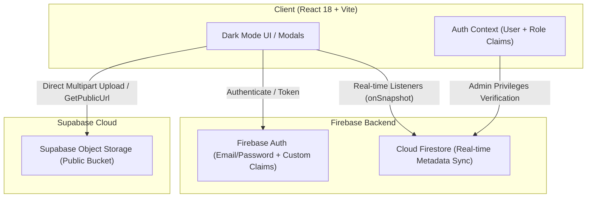

<div align="center">

# ⬡ ClassShare

**Collaborative cloud file-sharing and code snippet platform built for student developer communities.**

[](https://react.dev/)
[](https://vitejs.dev/)
[](https://firebase.google.com/)
[](https://supabase.com/)
[](https://www.docker.com/)
[](./LICENSE)

[🌐 Live Demo](#-live-demo) • [✨ Key Features](#-key-features) • [🏛 Architecture](#-architecture) • [🚀 Quick Start](#-quick-start) • [🛡 Security](#-security--access-control)

</div>

---

## 💡 About The Project

**ClassShare** was created to solve a real-world communication friction in developer training cohorts: sharing homework code snippets, assets, PDF documentation, and team deliverables quickly without relying on cluttered chat apps or paid cloud drives.

It adopts a **cost-efficient hybrid serverless architecture**, leveraging:
- **Firebase Authentication & Cloud Firestore** for zero-latency reactive data streams (`onSnapshot`) and granular user roles (Custom Claims).
- **Supabase Storage** for unmetered public file delivery, avoiding costly bandwidth quotas on Google Cloud Storage.

---

## 🌐 Live Demo

> **Demo URL:** [https://classshare-demo.vercel.app](https://classshare-demo.vercel.app) *(Deploy your own in 2 minutes)*

Recruiters and portfolio visitors can test the live application instantly with **one click** via the built-in **"⚡ Prova rapida con Account Demo"** button on the login screen, without needing to register a personal email.

---

## ✨ Key Features

- **📁 Multi-File Upload & Drag-and-Drop:** Queue and upload multiple files simultaneously with individual upload progress indicators.
- **`</>` Instant Code Snippet Sharing:** Paste source code directly into the browser, pick language/extension (`.js`, `.py`, `.sql`, `.ts`, etc.), and generate downloadable source files on the fly.
- **👁 Inline Previews:**
  - **Code:** Syntax preview directly in a modal without downloading.
  - **Images:** High-resolution zoomable lightbox.
  - **PDF Documents:** Embedded interactive PDF viewer.
- **📂 Project Workspaces:** Group files into course modules or project assignments with folder management.
- **🏷 Dynamic Tagging & Instant Filtering:** Filter files by category (`Codice`, `Documenti`, `Immagini`, `Altro`), click tags to filter in real-time, or use universal search.
- **⚙️ Role-Based Admin Panel:** Built with Firebase Admin SDK (`customUserClaims`). Allows designated admins to inspect overall storage usage, reassign files between projects, reset user passwords, and perform cascading deletions across storage and database.
- **📱 Fully Responsive:** Dark mode user experience optimized for desktop and mobile, with bottom-sheet navigation on smaller viewports.

---

## 🏛 Architecture



---

## 🚀 Quick Start

### Prerequisites
- Node.js `20.x` or higher
- npm or pnpm
- (Optional) Docker & Docker Compose

### 1. Clone the repository
```bash
git clone https://github.com/badalirek-ux/classshare.git
cd classshare
```

### 2. Configure Environment Variables
Copy the template and fill in your Firebase and Supabase credentials:
```bash
cp .env.example .env.local
```

| Variable | Description | Default / Example |
| :--- | :--- | :--- |
| `VITE_FIREBASE_API_KEY` | Firebase Web API Key | `AIzaSy...` |
| `VITE_FIREBASE_PROJECT_ID`| Firebase Project ID | `your-project` |
| `VITE_FIREBASE_AUTH_DOMAIN`| Firebase Auth Domain | `your-project.firebaseapp.com` |
| `VITE_SUPABASE_URL` | Supabase Project URL | `https://xyz.supabase.co` |
| `VITE_SUPABASE_ANON_KEY` | Supabase Public Anon Key | `eyJhbG...` |
| `VITE_ALLOWED_DOMAIN` | Optional email domain restriction | `@university.edu` *(or empty for all)* |
| `VITE_DEMO_EMAIL` | One-click demo login email | `demo@classshare.app` |
| `VITE_DEMO_PASSWORD` | One-click demo password | `ClassShareDemo2025!` |

---

### 3. Run Locally

#### Option A: With Docker Compose
```bash
docker compose up --build
```
Open [http://localhost:3003](http://localhost:3003) in your browser.

#### Option B: With Node.js
```bash
npm install
npm run dev
```
Open [http://localhost:5173](http://localhost:5173) in your browser.

---

## ⚙️ Administration & Custom Claims

To grant administrator access to a specific instructor or developer account, use the provided Node.js script:

```bash
node scripts/set-admin.mjs user@example.com ./service-account.json
```
*The user will immediately gain access to the Admin Dashboard upon their next login.*

---

## 🛡 Security & Access Control

- **Cloud Firestore Security Rules (Production):**
```javascript
rules_version = '2';
service cloud.firestore {
  match /databases/{database}/documents {
    match /profiles/{uid} {
      allow read: if request.auth != null;
      allow write: if request.auth.uid == uid || request.auth.token.admin == true;
    }
    match /files/{fileId} {
      allow read: if request.auth != null;
      allow create: if request.auth != null;
      allow delete: if request.auth != null && (
        request.auth.uid == resource.data.uploadedBy || request.auth.token.admin == true
      );
      allow update: if request.auth != null && (
        request.auth.uid == resource.data.uploadedBy || request.auth.token.admin == true
      );
    }
    match /projects/{projectId} {
      allow read: if request.auth != null;
      allow create: if request.auth != null;
      allow delete, update: if request.auth != null && (
        request.auth.uid == resource.data.createdBy || request.auth.token.admin == true
      );
    }
  }
}
```

---

## 📄 License

This project is licensed under the MIT License - see the [LICENSE](./LICENSE) file for details.

---

<div align="center">
  <sub>Developed with ❤️ by <a href="https://github.com/badalirek-ux">Nicola Badalì</a></sub>
</div>
